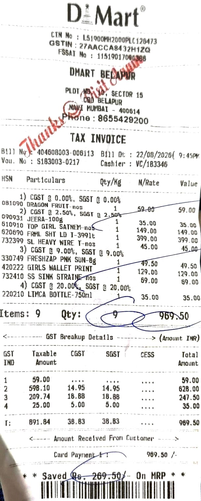
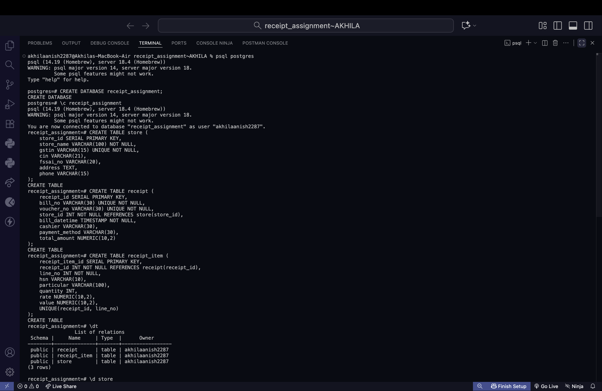
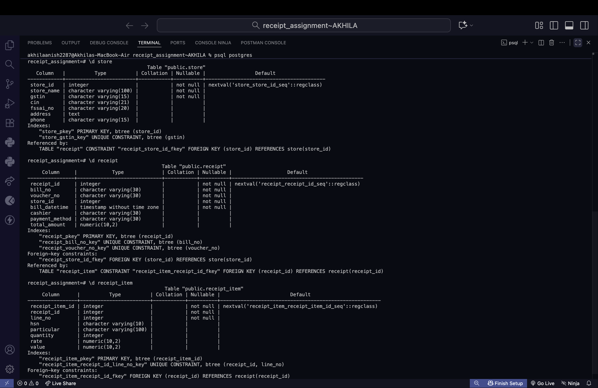
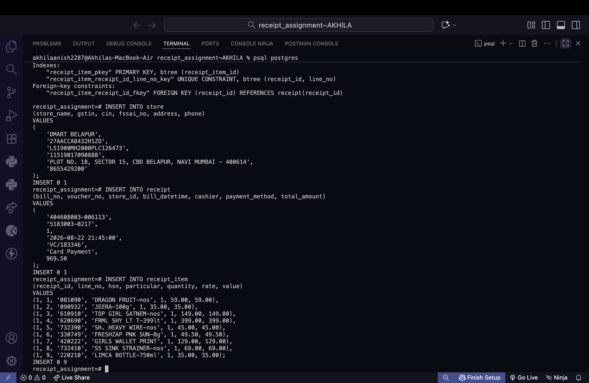
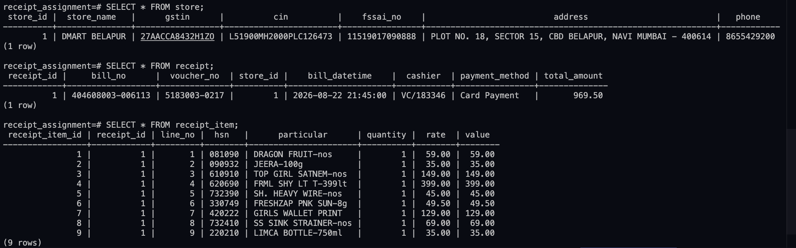
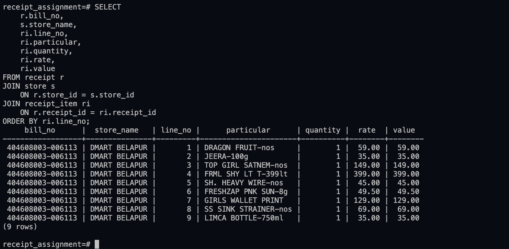

# 🗄️ SQL Assignment 2 — Database Keys

### Primary, Foreign & Candidate Keys — Real-World Receipt Analysis

---

## 👩‍💻 Student Information

| Detail         | Information                         |
| -------------- | ----------------------------------- |
| **Name**       | Akhila Anish Das                    |
| **Roll No.**   | 150096725016                        |
| **Batch**      | Larry Page 2025–2029                |
| **Course**     | B.Tech Computer Science Engineering |
| **Subject**    | DBMS — SQL & NOSQL                  |
| **Assignment** | Assignment 2 – Database Keys        |
| **Database**   | PostgreSQL                          |
| **Faculty**    | Prof. Chandrika Kamble              |  

---

## 📌 About the Assignment

This assignment focuses on understanding **Candidate Keys, Primary Keys, and Foreign Keys** using a real-world purchase receipt.

For this assignment, I analysed a recent **DMART BELAPUR** receipt and converted its information into a relational database design.

The receipt information was divided into three logical tables:

* `store`
* `receipt`
* `receipt_item`

The database was implemented and tested using **PostgreSQL**.

---

## 🧾 Original Receipt

The original receipt used for this assignment is shown below.

<p align="center">
  
</p>

### Receipt Details

| Field              | Value            |
| ------------------ | ---------------- |
| **Store**          | DMART BELAPUR    |
| **Bill No.**       | 404608003-006113 |
| **Bill Date**      | 22/08/2026       |
| **Time**           | 9:45 PM          |
| **Payment Method** | Card Payment     |
| **Total Amount**   | ₹969.50          |
| **Items**          | 9                |

---

## 🗂️ Database Tables

### 1. `store`

Contains information about the D-Mart store.

```text
store_id
store_name
gstin
cin
fssai_no
address
phone
```

**Primary Key:** `store_id`

**Candidate Keys:**

* `store_id`
* `gstin`

---

### 2. `receipt`

Contains information about the purchase transaction.

```text
receipt_id
bill_no
voucher_no
store_id
bill_datetime
cashier
payment_method
total_amount
```

**Primary Key:** `receipt_id`

**Candidate Keys:**

* `receipt_id`
* `bill_no`
* `voucher_no`

---

### 3. `receipt_item`

Contains information about each individual item purchased.

```text
receipt_item_id
receipt_id
line_no
hsn
particular
quantity
rate
value
```

**Primary Key:** `receipt_item_id`

**Candidate Key:**

`(receipt_id, line_no)`

---

## 🔑 Understanding the Keys

### Primary Key (PK)

A **Primary Key** uniquely identifies each row in a table.

In this assignment:

```text
store.store_id          → Primary Key
receipt.receipt_id      → Primary Key
receipt_item.receipt_item_id → Primary Key
```

### Foreign Key (FK)

A **Foreign Key** connects one table to another by referring to the Primary Key of another table.

In this assignment:

```text
receipt.store_id
        ↓
store.store_id
```

and

```text
receipt_item.receipt_id
        ↓
receipt.receipt_id
```

### Candidate Key

A **Candidate Key** is a column or combination of columns that could uniquely identify a row and therefore could potentially be selected as the Primary Key.

---

## 🔗 Table Relationships

```text
┌──────────────┐
│    STORE     │
│──────────────│
│ store_id PK  │
└──────┬───────┘
       │
       │ store_id FK
       ▼
┌──────────────┐
│   RECEIPT    │
│──────────────│
│ receipt_id PK│
│ store_id FK  │
└──────┬───────┘
       │
       │ receipt_id FK
       ▼
┌────────────────────┐
│   RECEIPT_ITEM     │
│────────────────────│
│ receipt_item_id PK │
│ receipt_id FK      │
└────────────────────┘
```

---

# 💻 PostgreSQL Implementation

## 1️⃣ Creating the Database

The main PostgreSQL database was created before implementing the tables.

<p align="center">
  
</p>

---

## 2️⃣ Creating the Tables

Three tables were created:

```text
store
receipt
receipt_item
```

The tables include appropriate **Primary Key, Foreign Key and UNIQUE constraints**.

<p align="center">
  
</p>

---

## 3️⃣ Inserting Receipt Data

The actual data obtained from the D-Mart receipt was inserted into the three tables.

<p align="center">
  
</p>

---

## 4️⃣ Displaying Inserted Values

The inserted records were retrieved from the three tables to verify that the data was stored correctly.

<p align="center">
  
</p>

---

## 5️⃣ Showing Keys & Relationships

The database structure and relationships between the Primary Keys, Foreign Keys and Candidate Keys were checked.

<p align="center">
  
</p>


---

# 🧮 SQL Operations Used

The assignment uses PostgreSQL SQL commands including:

```sql
CREATE DATABASE
CREATE TABLE
INSERT INTO
SELECT
PRIMARY KEY
FOREIGN KEY
UNIQUE
REFERENCES
```

The SQL implementation is available in:

**`receipt_assignment.sql`**

---

# 📊 Database Structure

| Table          | Primary Key       | Foreign Key  | Purpose                           |
| -------------- | ----------------- | ------------ | --------------------------------- |
| `store`        | `store_id`        | —            | Stores store information          |
| `receipt`      | `receipt_id`      | `store_id`   | Stores transaction information    |
| `receipt_item` | `receipt_item_id` | `receipt_id` | Stores purchased-item information |

---

# 🛠️ Tools & Technologies

* **PostgreSQL**
* **SQL**
* **pgAdmin / psql**
* **GitHub**
* **Google Docs**

---

# 📁 Repository Structure

```text
receipt_assignment-AKHILA/
│
├── README.md
│
├── receipt_assignment.sql
│
└── screenshotzzz/
    ├── BILL-OG.png
    ├── CREATE-DB.png
    ├── CREATE-TB.png
    ├── INSERT-VL.png
    ├── SHOW-KEY-RL.png
    └── SHOW-VL-TB.png
```

---

# 🎯 Learning Outcomes

Through this assignment, I learned how to:

* Analyse a real-world receipt from a database perspective.
* Identify entities and attributes.
* Identify Candidate Keys.
* Select suitable Primary Keys.
* Identify Foreign Keys.
* Establish relationships between tables.
* Create relational tables using PostgreSQL.
* Apply constraints such as `PRIMARY KEY`, `FOREIGN KEY` and `UNIQUE`.
* Insert real-world data into a database.
* Retrieve and verify stored records using `SELECT`.

---

# ✅ Conclusion

This assignment helped me understand how **database keys are applied to real-world data**.

By converting a D-Mart receipt into the `store`, `receipt`, and `receipt_item` tables, I was able to practically implement **Candidate Keys, Primary Keys and Foreign Keys** in PostgreSQL.

The database was successfully designed using SQL and the inserted data was verified through PostgreSQL queries.

---

### 📚 Assignment

**Assignment 2 – Database Keys**

**Primary, Foreign and Candidate Keys**

**Real-World Receipt Analysis**

---

<p align="center">
  <b>Built as part of my B.Tech Computer Science Engineering coursework.</b>
</p>
